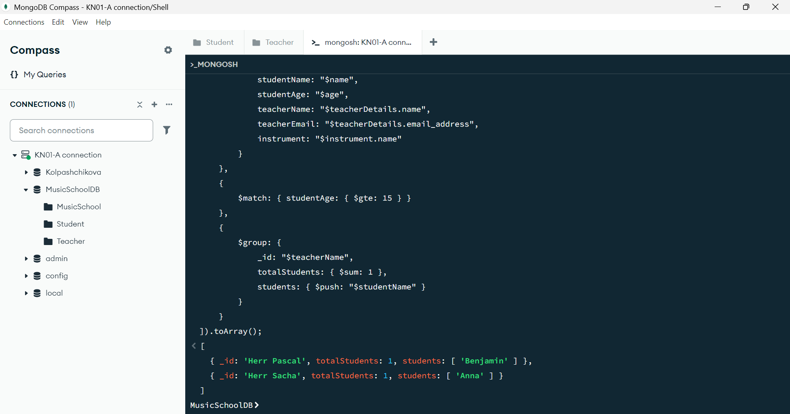

## KN04 Datenmanipulation und Abfragen 2

### Abgabe Aufgabe A
Here is the [script](aggregation-collections.js) where i use $match, $project and $group aggregations.

This is the output of the aggregations:

As you can see i output first each result of the aggregations and at the end it groups Alissa's and Anna's age for teacher Herr Sacha and as the second output is Benjamin with age 16 because his teacher is Herr Pascal.

### Abgabe Aufgabe B & C
Here is the [script](join-aggregations.js) where i do $lookup to join. I join student with teacher, by matching that the students can be 15 years old or older.  
I had to use unwind, in order to form teacherDetails into one object because it gave me errors without unwind.  
Here is the output of the lookup:

