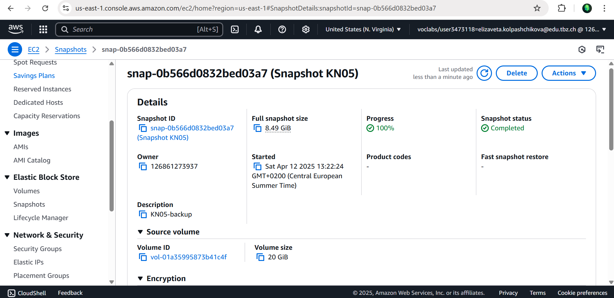
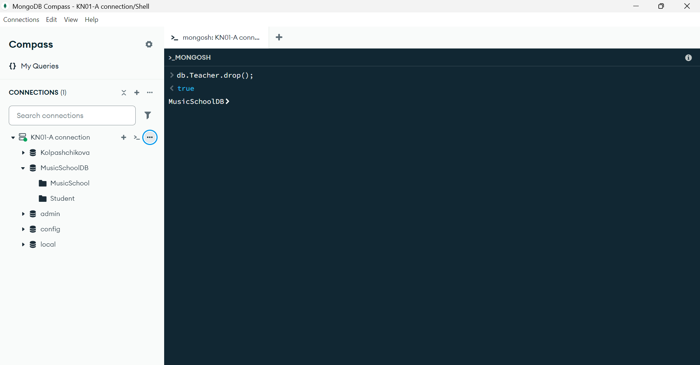
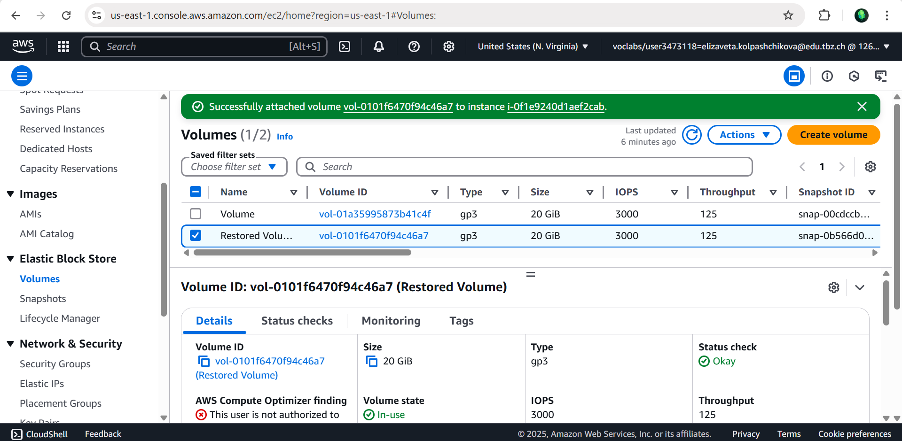
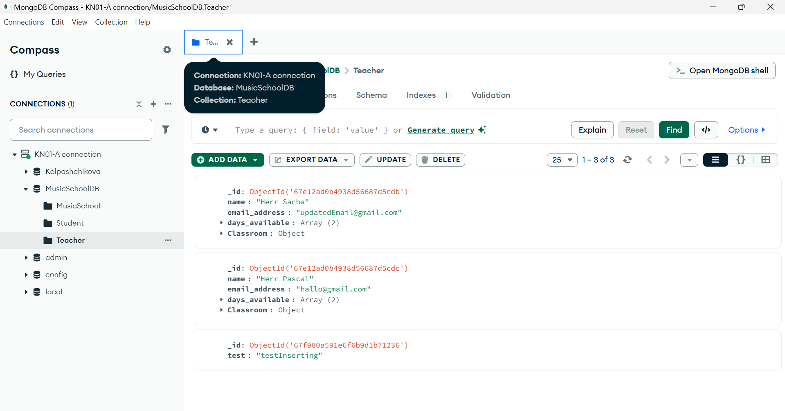
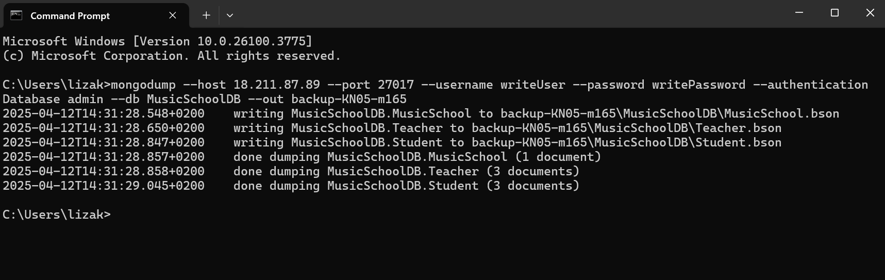
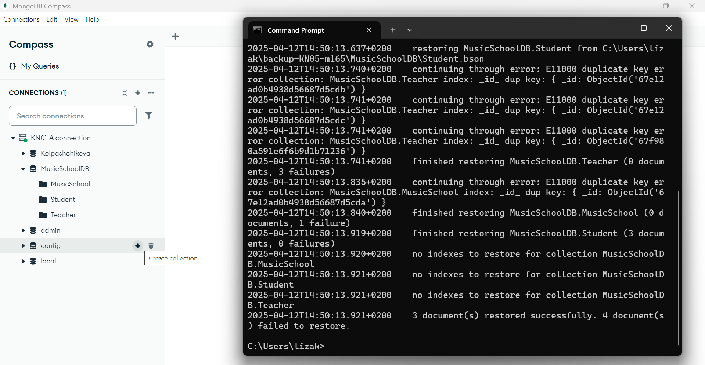

## KN05 Administration von MongoDB

### Abgabe Aufgabe A
Encountering an error when adjusting authSource with a different DB:


Here is my [script](createNewUsersForDBs.js) to create the two users with different rights (read and write) and also the commands to read and write in collections.  

Screenshots with **Reader User**:  
Authenticating with reader rights:  
-   

Finding Teacher with reader rights:  
-   

Inserting with reader rights:  
- 

Screenshots for **Writer User**:  
Authenticating with writer rights:  
-   

Finding Teacher with reader rights:  
-   

Inserting with reader rights:  
- 

### Abgabe Aufgabe B  

**Backup Variante 1:**  
Screenshot of the created snapshot status:  
- 

Deleted collection from MusicSchoolDB in Compass MongoDB:
-   

Detached old volume and attached newly restored volume to instance:
-   
Restored Collection of Teacher:
-   

The only command used was ```db.Teacher.drop()`` and everything else was done through AWS Console.

**Backup Variante 2:**  
Here i connected myself to the EC2 and created a **MongoDump**:

   
  

Using this command i restored the DB through the terminal:  
``mongorestore --host 18.211.87.89 --port 27017 --username writeUser --password writePassword --authenticationDatabase admin --db MusicSchoolDB "C:\Users\lizak\backup-KN05-m165\MusicSchoolDB"``  



### Abgabe Aufgabe C  
