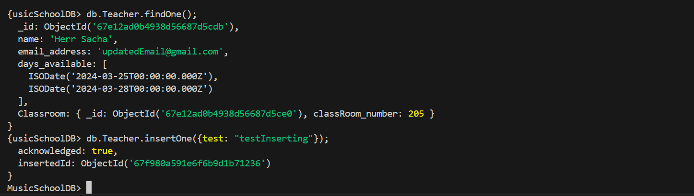

## KN05 Administration von MongoDB

### Abgabe Aufgabe A
Encountering an error when adjusting authSource with a different DB:

Here is my [script](createNewUsersForDBs.js) to create the two users with different rights (read and write) and also the commands to read and write in collections.  

Screenshots with **Reader User**:  
Authenticating with reader rights:  
-   

Finding Teacher with reader rights:  
-   

Inserting with reader rights:  
- 

Screenshots for **Writer User**:  
Authenticating with writer rights:  
-   

Finding Teacher with reader rights:  
-   

Inserting with reader rights:  
- 

### Abgabe Aufgabe B  
