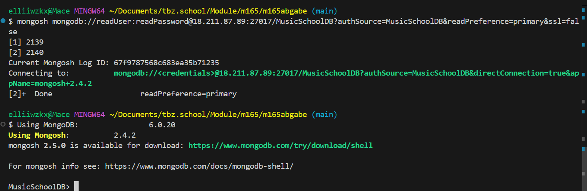
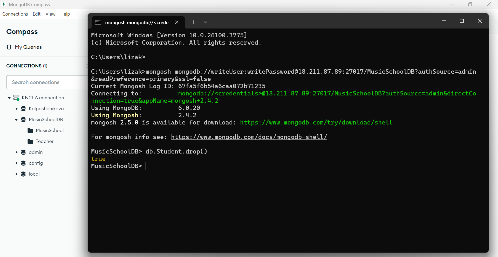

## KN05 Administration von MongoDB

### Abgabe Aufgabe A
Encountering an error when adjusting authSource with a different DB:


Here is my [script](createNewUsersForDBs.js) to create the two users with different rights (read and write) and also the commands to read and write in collections.  

Screenshots with **Reader User**:  
Authenticating with reader rights:  
-   

Finding Teacher with reader rights:  
-   

Inserting with reader rights:  
- 

Screenshots for **Writer User**:  
Authenticating with writer rights:  
-   

Finding Teacher with reader rights:  
-   

Inserting with reader rights:  
- 

### Abgabe Aufgabe B  

**Backup Variante 1:**  
Screenshot of the created snapshot status:  
- 

Deleted collection from MusicSchoolDB in Compass MongoDB:
-   

Detached old volume and attached newly restored volume to instance:
-   
Restored Collection of Teacher:
-   

The only command used was ```db.Teacher.drop()`` and everything else was done through AWS Console.

**Backup Variante 2:**  
Here i connected myself to the EC2 and created a **MongoDump**:

   
  

Using this command i restored the DB through the terminal:  
``mongorestore --host 18.211.87.89 --port 27017 --username writeUser --password writePassword --authenticationDatabase admin --db MusicSchoolDB "C:\Users\lizak\backup-KN05-m165\MusicSchoolDB"``  


### Abgabe Aufgabe C  
Difference between Replication and Partition (Shards):  
**Replication** means having one server or a db and then one more server or db which is a duplication of the first one. Because that means if the first one collapses or goes down, the second one that was there as a backup will be used. So the same data is stored in both versions.

**Partition (sharding)** means splitting the data. It's data being split into smaller pieces, which is 
called **shards** across different servers. The data is different in all servers so there is no second duplicated object in sharding that contains the same data, it's all different.  

For the company, if Accenture uses Replication, then it's a better choice to choose Partition, because the data increases, which would be better to be stored as shards so the Partitioning way. Data will be scaled horizontally. 
