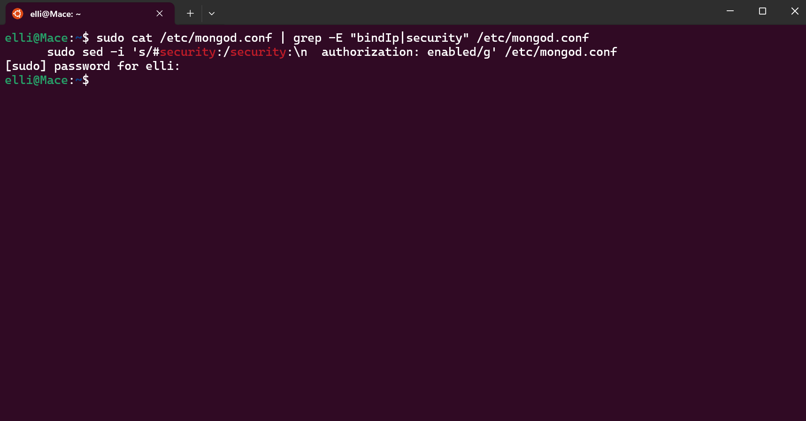
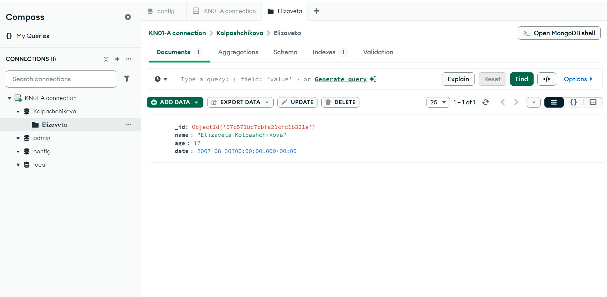

## KN01 Connections and Managing MandoDB

### Installation A

i used this command in cmd to connect to the instance: "ssh -i elizaveta-1.pem ubuntu@18.211.87.89"

### Abgabe Aufgabe A
- [Cloud-init](./cloudinit-mongodb.yaml) File

- Compass Screenshot:

- "authSource=admin" in the Connection String defines that we're trying to connect to the authentication database with the authSource parameter in the Url. MongoDB uses "admin" database as default.

- the first sed statement in the cloud-init file replaces the commented out security with authentication. That means that without the authentication, i will not be able to connect to the database. With the second sed statement, it modifies from localhost ip to 0.0.0.0

- Screenshot of the two sed commands in mongodb config file:

### Abgabe Aufgabe B
- Json File before inserting:

- After inserting and updating the date datatype:

- Here is my [JSON File](./Kolpashchikova.Elizaveta-MongoDB.json) Exported
It is also possible to adjust it with ``date: {"date": "30.08.2007"}`` then it will display it as a string format or with a date format like this: ``date: {"$date": "30.08.2007"}``.
Date is only reconginzed in MongoDB with this syntax ``date: {"$date": "30.08.2007"}`` otherwise it wouln't allow or display the correct format.

### Abgabe Aufgabe C
