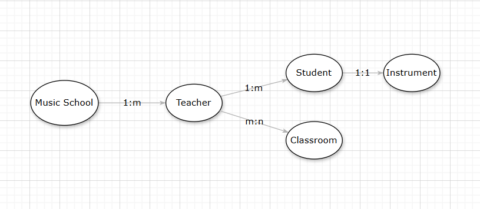
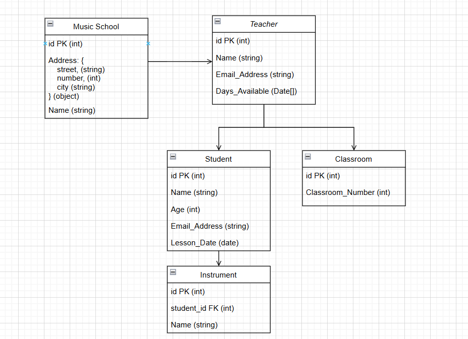

## KN02 Datenmodellierung für MongoDB

### Abgabe Aufgabe A

I did a conceptual model diagram of my music school. There are five entites: music school, teachers, students, instruments and classrooms. Class rooms can either have 1 teacher or many. Teachers teach at the school and have several class rooms. They also have multiple students and each student has only one teacher and one instrument that they play.
  

### Abgabe Aufgabe B
Here is my logical data model to the conceptual model from before. I did a nesting (Verschachtelung) in Music School entity. The address is an object and has multiple properties in it. Also have two date types, in the Teacher and Student entities.

