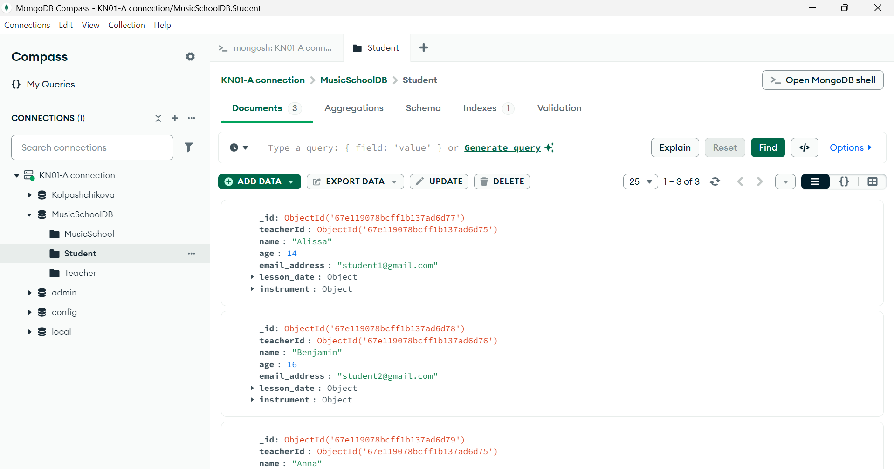
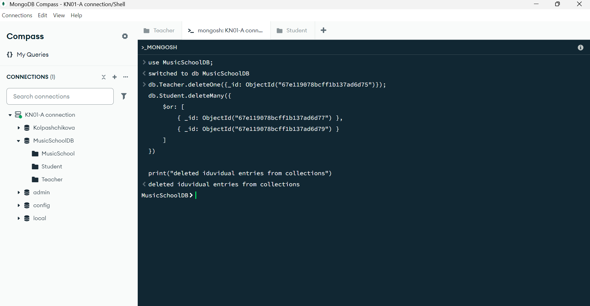
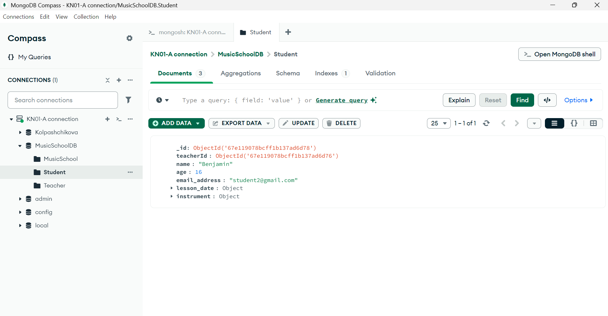

## KN03 Datenmanipulation und Abfragen 1

### Abgabe Aufgabe A
Here is the script to **insert** the data into the db: [script](script-daten-hinzufügen.js)  
These are screenshots to show that the commands worked and showed that the data was inserted. Also a screenshot to show that the data is set in a collection:

### Abgabe Aufgabe B
This is the script to delete only the collections from the db: [deleteCollections](delete-whole-collection.js)
Thats the output when i run it in mongosh. As you can see the MusicSchoolDB is empty:

Thats the output of the commands that individual entries are deleted in mongosh:

